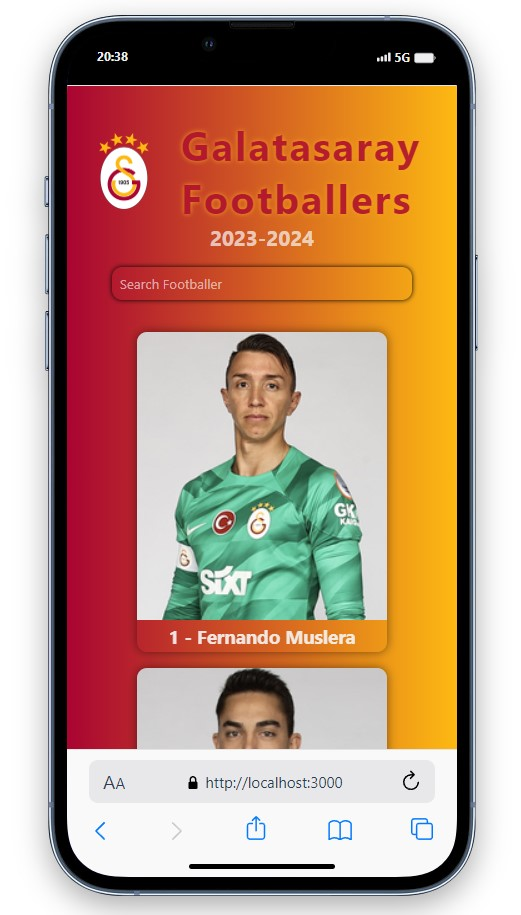
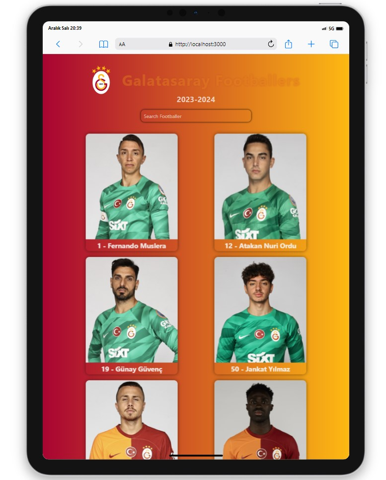
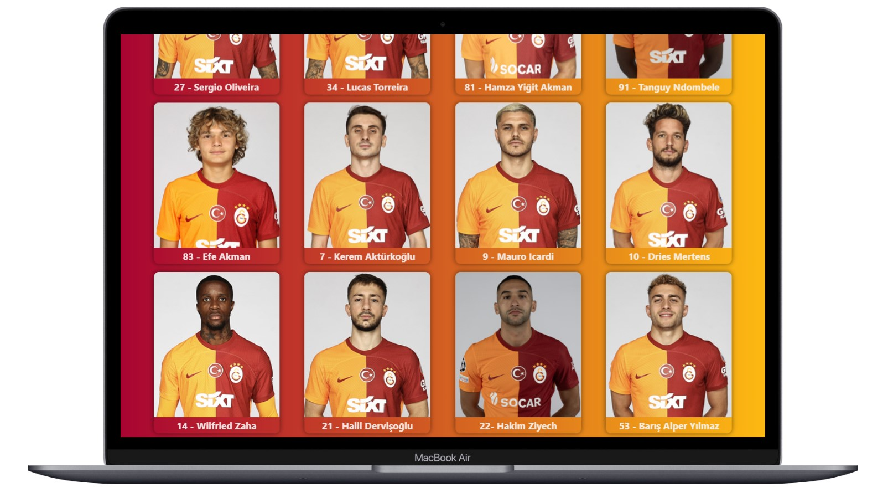

# Galatasaray Footballers Web Application

<div align="center">
  
</div>

## About the Project

Welcome to the Galatasaray Footballers web application! This project provides a platform to explore detailed information about Galatasaray Sports Club's football players, including career statistics, photos, and personal details.

## Live Demo

[Galatasaray Footballers Demo](https://galatasaray-footballers.vercel.app/)

## Features

- View detailed profiles of football players.
- Stay updated on current career statistics.
- Get to know players with photos and personal information.

## Project Skeleton

```
Galatasaray Footballers(folder)
|
|----readme.md        
SOLUTION
├── public
│     └── index.html
├── src
│    ├── assets
│    ├── components
│    │       ├── Header.jsx
│    │       ├── CardContainer.jsx
│    │       └── PlayerCard.jsx
│    ├── helper
│    │       └── data.js  
│    ├── App.js
│    ├── App.css
│    ├── index.js
│    └── index.css
├── package.json
└── yarn.lock
```

## Screenshots

<div align="center">
  
  
  
</div>

## Compatibility

The project is compatible with both wide-screen computers and mobile devices.

## Usage

Upon starting the application, you will see a short list of Galatasaray footballers on the home page. Each player card contains a photo and basic information. Clicking on a player card will redirect you to a detailed profile page. On the profile page, you can find career statistics, personal details, and photos.
